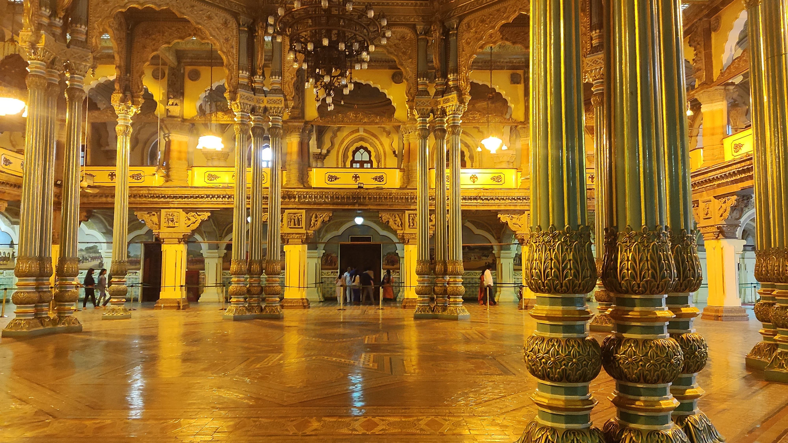
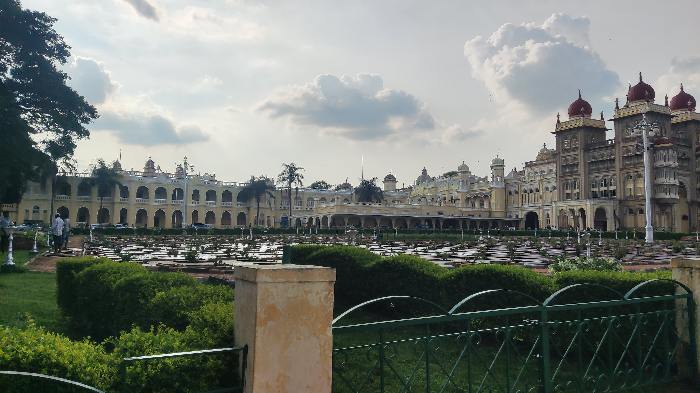
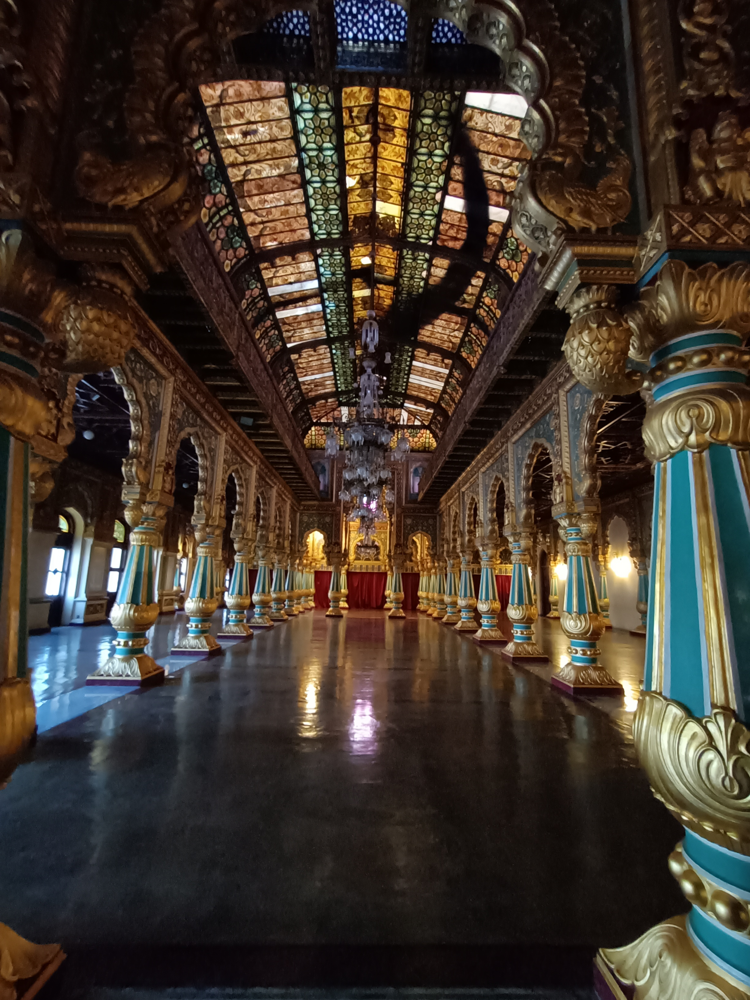
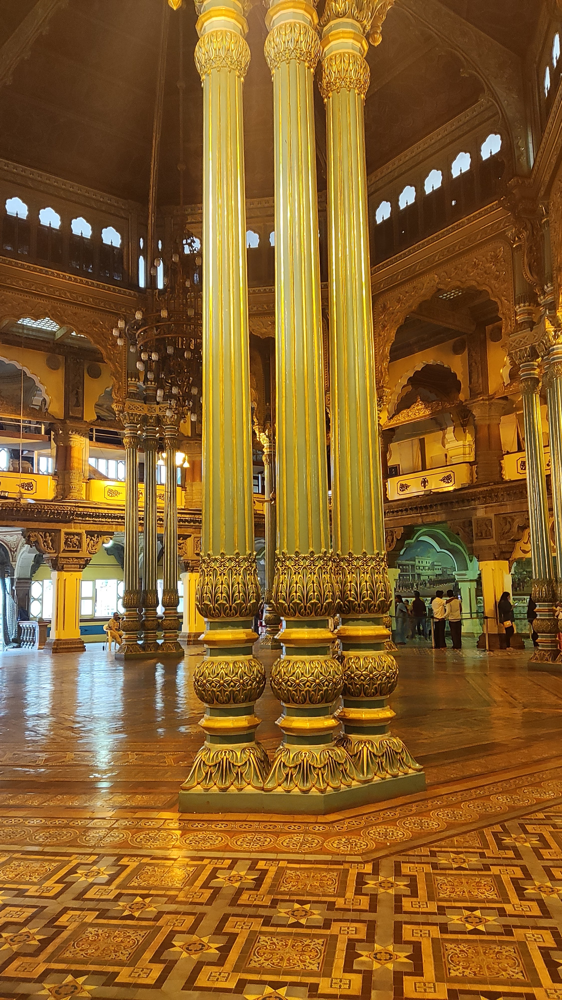
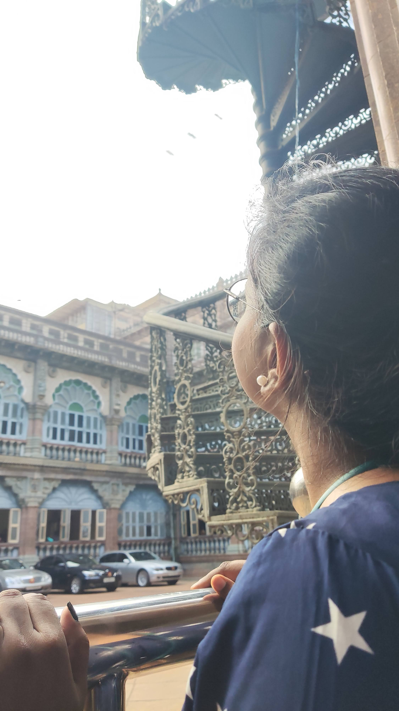
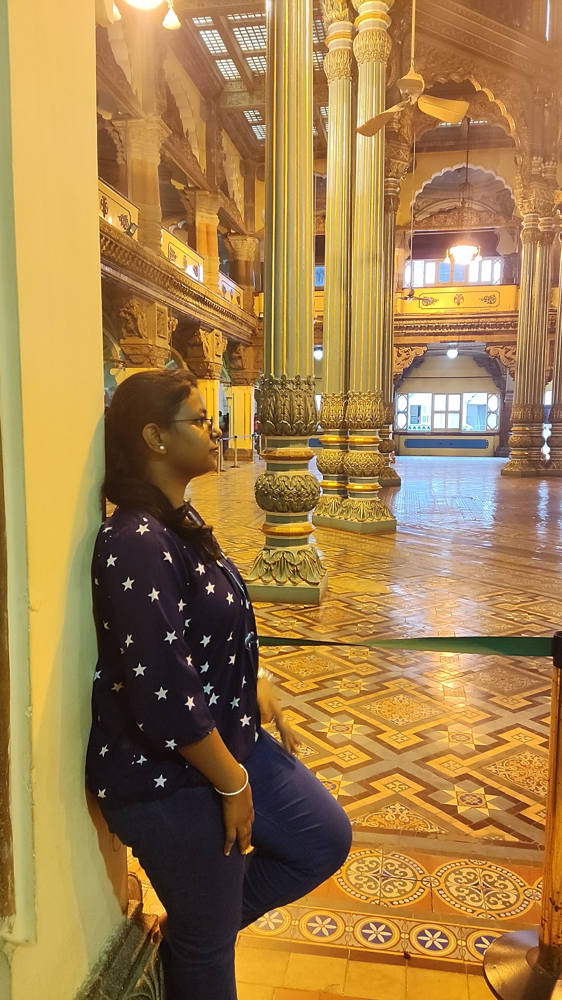
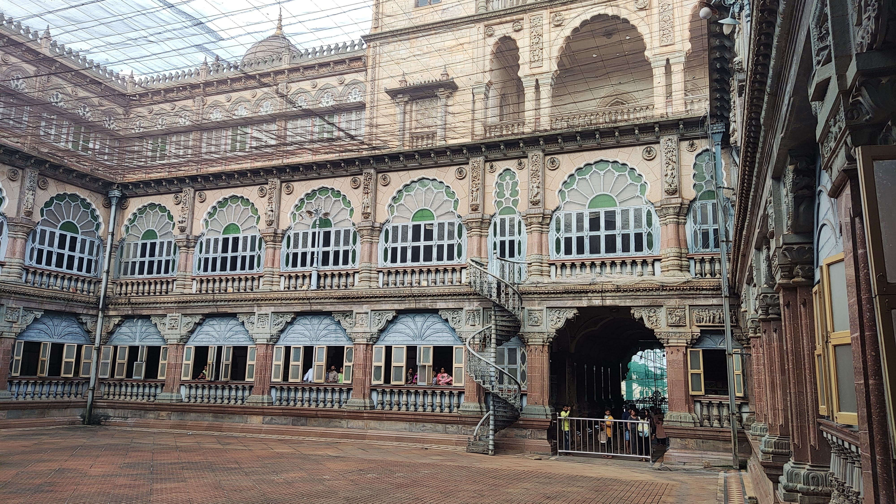
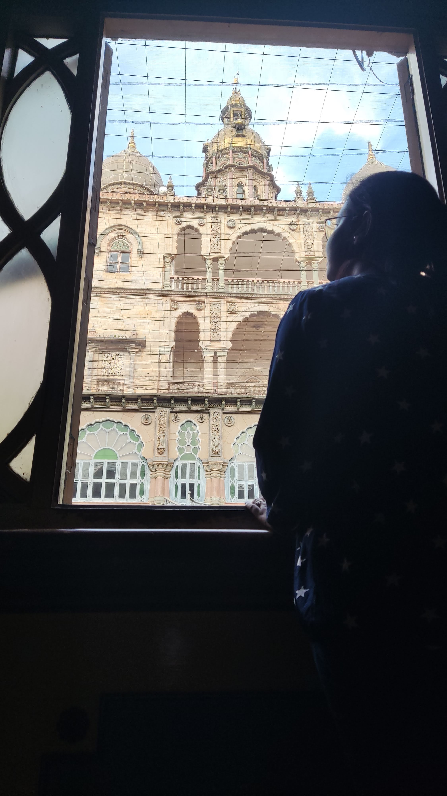
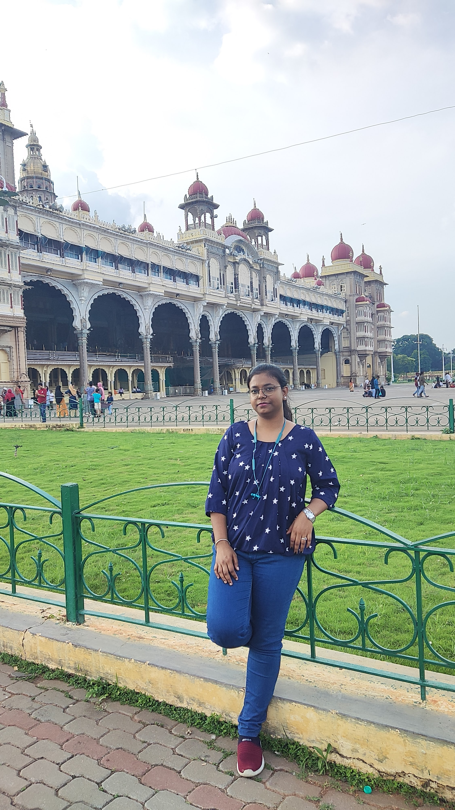
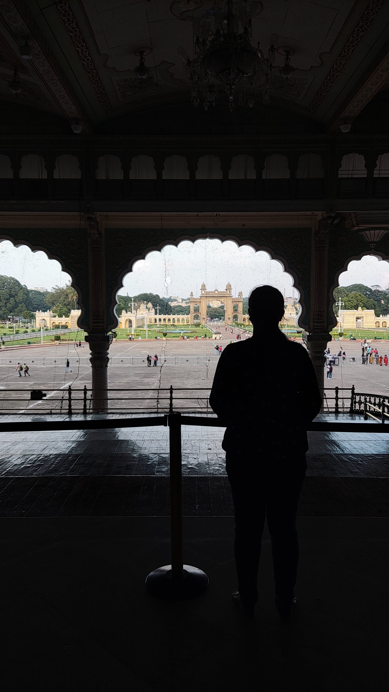

An incredibly breathtaking example of Indo-Saracenic style of architecture, the *Mysore Palace* is a magnificent palace located in Mysore in the state of Karnataka.

It's also known as the Amba Vilas Palace, it is the former palace of the royal family of Mysore and is still their official residence.

Mysore Palace was built in the year 1912 for the 24th Ruler of the Wodeyar Dynasty and is counted amongst one of the biggest palaces in the country.

The Majestic structure is extremely spacious and well designed. The architectural and aesthetic beauty of this palace mesmerized me.

The four arched gates give way to a large garden area which surrounds the palace. The garden area is really beautiful to hangout with family and friends.

Stepping inside the palace feels like you’re in a glamorous Bollywood movie. The most notable elements of the Mysore Palace are The Durbar Hall, the Ambavilasa, the royal howdah (elephant seat made with 84kg of gold), the Kalyana Mantapa, a portrait gallery as well as the many items on display. You need to remove your footwear for the interior tour.

## Durbar Hall

This hall is fully decorated in pink, yellow and turquoise with beautifully painted columns all symmetrically spaced across the hall.
The walls of the Durbar Hall are decorated with many paintings from different times.

## Ambavilas

Similar in design and style to The Durbar Hall is the Ambavilasa room. This room is also spectacular because of the amount of gold used on the gilded columns and the stained glass ceiling which is a masterpiece.

## Kalyana Mantapa

Kalyana Mantapa, also known as the marriage hall, is one of the first halls you will see in your visit and it is sure to leave you speechless. The hall is octagonal in shape and the amount of detail and work that went into the room, with its vaulted domed ceiling and gilded columns, is remarkable.

## Tips

  - A must visit place in Karnataka.
  - The construction is stunning to see from the outside, especially at night on Sundays and public holidays when it is lit with 97,000 lights.
  - Take your time to feel the aesthetic beauty of your surrounding.
  - You can go for a guide and the audio guide.

## Timings

Mysore Palace remains open from 10 am to 5.30 pm every day.

## Entry fees

The entry fee for 
  - Adults Rs 100 / head.
  - Children above 10 years and below 18 years Rs 50 / head.

*Cost information here is based on my visit on **4th September, 2022**. So prices may differ.*

### Glimpse of my visit

***
